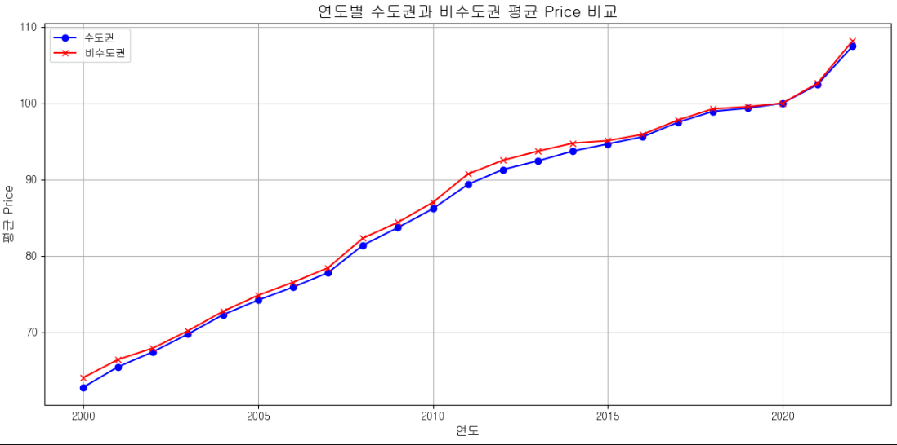

# 저출산 문제
### 가설 1: 결혼율 감소가 출생률 하락의 주요 원인일것이다.

-> 히트맵 확인결과 결혼률과 출생률은 49%정도의 유의미한 상관관계에 있다.

-> 또한 시간이 지남에따라 결혼률이 감소하는데 출산율도 비슷하게 감소한다.

결론 : 결혼율이 감소하면 출산률도 함께 감소한다.

### 가설 2 : 지역별 경제 수준이 높을수록 출산율이 올라갈것이다.

1인당 경제소득이 올라갈수록 출산율도 올라간다.

### 가설 3: 수도권의 높은 생활비가 출산 기피로 이어진다.
- 먼저 수도권과 비 수도권의 출산율을 비교해보자

- 시간이 지날수록 수도권과 비수도권 모두 출산율 감소
- 연도별 수도권과 비수도권의 물가지수비교

- 이 그래프는 연도별 수도권과 비수도권의 물가지수비교 그래프이다
- 그래프를 보면 수도권과 비수도권의 평균 물가지수가 별로 차이가 나지 않는 것을 알 수 있다.
- 출처 : https://kosis.kr/statHtml/statHtml.do?sso=ok&returnurl=https%3A%2F%2Fkosis.kr%3A443%2FstatHtml%2FstatHtml.do%3Fconn_path%3DMT_GTITLE01%26list_id%3D105%26obj_var_id%3D%26seqNo%3D%26tblId%3DINH_1J22003%26vw_cd%3DMT_GTITLE01%26itm_id%3D%26language%3Dkor%26lang_mode%3Dko%26orgId%3D101%26
### 결론
- 수도권과 비수도권을 비교했을 때 출산율은 별로 차이가 없는 것을 확인
- 각 지역별 물가지수도 전체적으로 별로 차이없는 것을 확인
- 가설3 : 수도권의 높은 생활비가 출산 기피로 이어진다. 이것은 의미없는 가설임을 알 수 있음.

### 가설 4 : 20~30대의 높은 실업률이 결혼율  감소에 주요 원인일 것이다. 
1) 혼인 건수 VS 실업자 수 

분석 :
> 20대
>- 혼인 건수 : 남녀 모두 2001년 이후 지속적 하락.
>- 실업자 수 : 일시적 상승 구간이 있으나, 혼인 건수와 상관된 변화는 보이지 않음.
>- 상관관계를 분석했을 때에도 남,녀 모두 0.26, -0.48로 두 변수 간 직접 인과관계 약함.
> 30대 
>- 혼인 건수 : 2013 정점 이후 하락.
>- 실업자 수 : 남녀 모두 변동성이 크며 패턴이 일정하지 않음.
>- 남성의 경우 2010~2015년 실업자 수가 하락하고 혼인건수가 증가하는 패턴이 있지만, 상관관계 분석 결과 0.32,0.21로 직접적인 인과관계는 약함.

정리 : 혼인 건수와 실업자 수의 변화는 독립적으로 나타나는 경향이 있다. 비율이 아닌 혼인 건수, 실업자 수로 조사하여 조사에 신뢰도가 낮아졌을 것으로 예상.
추가 : 20,30대의 인구수 데이터, 남녀 성비 데이터를 통해서 20,30대의 남녀 인구수를 추가하여 혼인율, 실업률을 계산.

2) 혼인율 VS 실업률

분석 : 20대 여자의 실업률이 남,여 모두의 혼인율에 -0.72, -0.62로 상관관계가 있다고 파악하였다.

분석 : 30대의 경우 실업률과 혼인율의 상관관계는 약함.

분석 : 그래프 분석 결과 20대의 혼인율은 지속적인 감소 추세, 실업률과 혼인율과의 유의미한 관계를 찾기 어렵다. 
30대의 경우도 유의미한 상관관계를 찾기 어렵다.

팩트 : 20대 여성 실업률과 혼인율은 음의 상관관계를 보였으나, 그래프를 보면 동일한 사회구조적 요인에 기인한 동시적 변화일 가능성이 있어 직접적인 인과관계로 해석하긴 어렵다.
--------------------

# 지방 공동화 문제
### 가설1 지방의 낮은 혼인율이 인구 감소를 가속화한다.

-> 수도권과 지방 모두 결혼율이 급감하고 있다, 출생률도 비례해서 감소하고 있다.
팩트 : 지방의 혼인률이 낮아서 인구감소하는것은맞다,
정리 : 지방, 수도권 모두 결혼율 감소로 인해 인구감소가 심각하므로 
       수도권 Vs 지방에서 인구감소가 꼭 지방의 낮은 혼인률에 문제가 아닌 전국단위에 결혼률,출산률 감소에 있다.

### 가설2 수도권의 자연증가율보다 지방의 자연증가율이 낮으며 2017년이후로부터 극심한 차이를 보이고 있다   
       출생률이 급격히 감소하고 사망률은 완만히 상승하는형태를 보이고있다 
       출생률이 급격히 감소하는데에 더해 사망률이 완만히 상승하는 형태에서 인구수 감수가온다

### 가설4 수도권으로의 인구 유입이 지방 인구 감소를 가속화한다
.png>)
분석 : 2019년 기점으로 지방의 인구유출이 심하게 나타나며 수도권에 인구가 많이 유입되며 수도권은 인구가 증가한다.
정리 : 수도권의 인구가 증가하며, 지방은 인구가 감소하고있다.

