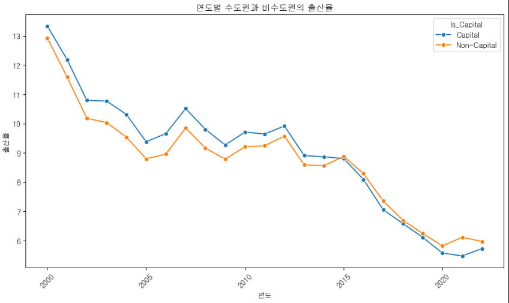
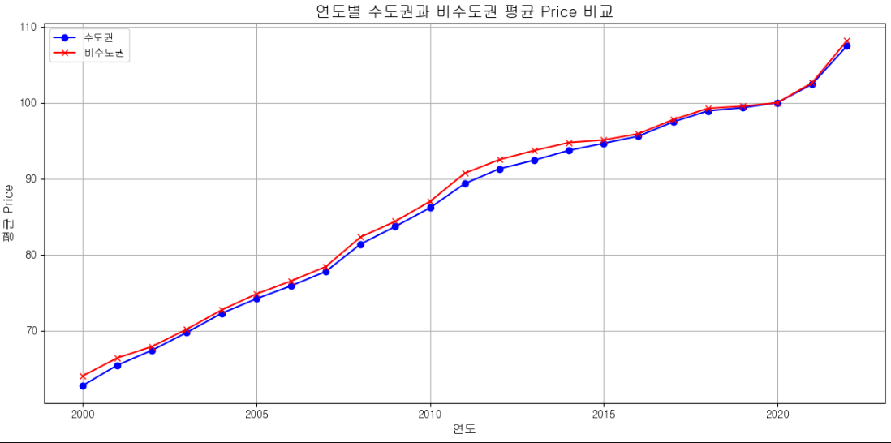
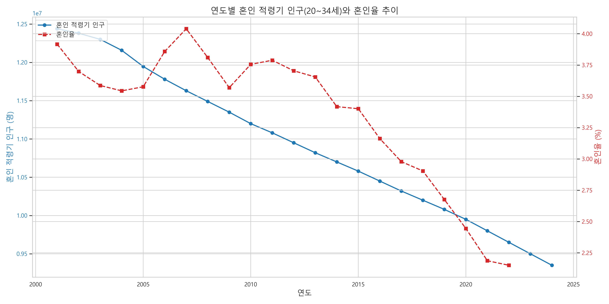
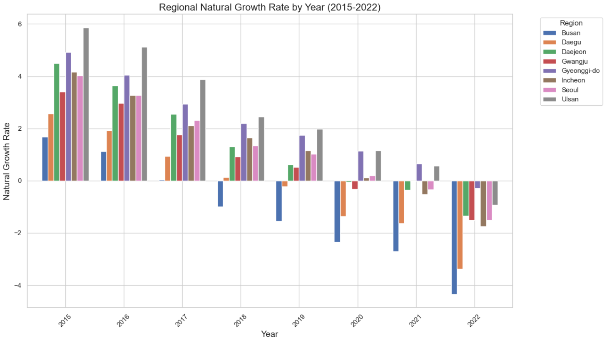
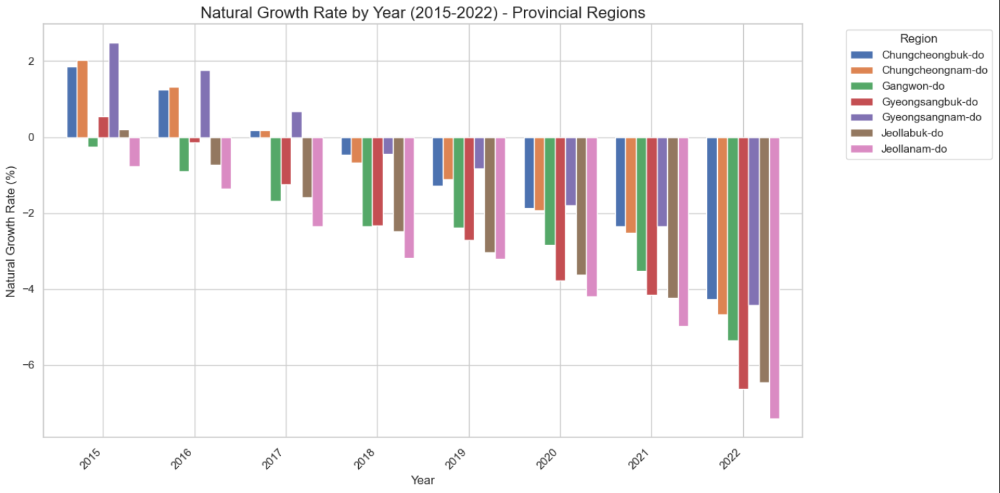

# 결론정리

## 저출산 문제
1) 가설1 결혼율 감소가 출생률 하락의 주요 원인일것이다. 
2) 가설2 지역별 경제 수준이 높을수록 출산율이 올라갈 것이다. 
3) 가설3 수도권의 높은 생활비가 출산 기피로 이어진다.
4) 가설4 20~30대의 높은 실업률이 결혼율 감소에 주요 원인일 것이다. 

### 가설 1. 결혼율 감소가 출생률 하락의 주요 원인일 것이다. 

-> Heat map 확인 결과 : 49.8%로 유의미한 상관관계가 있음을 알 수 있다.  

-> 그래프 확인 결과 : 결혼률과 출생률은 유사한 비율로 동반하락하고 있다.

#### 결론 : 결혼율과 출생률 간에는 직접적인 상관관계가 존재하며, 따라서 한쪽의 지속적인 감소는 다른 쪽의 하락을 유발하는 구조적 영향을 미칠 수 있다.

### 가설 2. 개인소득의 증가는 자연증가율을 증가시킬 것이다. (기존에서 그래프 기반으로 수정)

-> 그래프 확인 결과 : 우상향 흐름을 보이고 있다. 
                    * 소득이 16,000 이상부터는 안정적으로 상승 : 이 지점부터는 경제력이 일정 수준 이상 확보되었을 때 출산이 뒷받침될 가능성이 나타난다.  

#### 결론 : 1인당 개인소득이 증가함에 따라 자연 증가율 또한 상승하는 경향을 보이며, 특히 일정 소득 수준(약 16,000 이상)부터는 출산율이 안정적으로 증가하는 패턴이 나타난다. 

### 가설 3. 수도권의 높은 생활비가 출산 기피로 이어진다. 

-> 그래프 확인 결과 : 시간이 지날수록 수도권과 비수도권 모두 출산율이 감소한다. 

-> 그래프 확인 결과 : 수도권과 비수도권의 평균 물가지수가 큰 차이를 보이지 않는다. 

#### 결론 : 수도권, 비수도권 모두 동일하게 상승하며, 출산률 또한 동일한 패턴으로 하락을 하고 있다. 두 지역의 동일한 패턴을 통해 물가 상승은 출산율 저하에 영향을 미칠 수 있다는 추론이 가능하다. 

### 가설 4. 20~30대의 높은 실업율이 결혼율 감소의 주요 원인일 것이다. 

-> Heat map 확인 결과 : 20대 여자의 실업률이 남,여 모두의 혼인율에 -0.72, -0.62로 유의미한 상관관계가 있어 보인다.

-> Heat map 확인 결과 : 30대에서는 유의미한 상관관계를 확인할 수 없다. 

-> 그래프 확인 결과 : 
- 20대의 혼인율은 지속적인 감소 추세를 모이며, 실업률과 혼인율과의 유의미한 관계를 찾기 어렵다. 
- 30대의 경우도 2010년~2015년에 남자의 실업률 감소하고 혼인율 증가하는 모습이 있지만, 전체적으로 유의미한 상관관계를 보이지 않음. 

#### 결론 : 20대 여자 실업률과 혼인율은 음의 상관관계를 보였으나, 그래프를 보면 동일한 사회구조적인 요인에 기반한 동시적 변화일 가능성이 있어 직접적인 인과관계로 해석하긴 어렵다. 30대 남자의 2010~2015년 그래프에서 나타난 패턴 또한 일시적인 현상이였으므로 직접적인 인과관계로 해석하기 어렵다. 혼인율과 실업률 간에는 일정 수준의 상관성은 존재하나, 직접적인 인과관계를 설명할 수 있을 만큼의 명확한 연결성은 확인되지 않았다.

#### 저출산문제 최종 결론
이번 분석에서는 저출산 문제의 원인을 다각도로 접근하기 위해 총 4개의 가설을 설정하고,
혼인율·출산율·실업률·소득 수준 등과의 관계를 중심으로 통계적/시계열적 검증을 진행하였다.

먼저, 가설 1을 통해 확인한 바와 같이
결혼율과 출생률은 유사한 시계열 흐름을 보이며 지속적으로 동반 하락하고 있어,
두 지표 간에는 직접적인 상관관계가 존재하는 것으로 나타났다.
이에 따라 한쪽의 감소는 다른 쪽의 하락을 유발할 수 있는 구조적 관계로 해석할 수 있다.

또한 가설 2 분석 결과,
1인당 개인소득이 일정 수준(약 16,000 이상)을 넘어서면서부터는 출산율이 안정적으로 증가하는 경향이 관측되었다.
이는 경제적 여건이 일정 기준 이상 확보되어야 출산에 대한 심리적·재정적 여유가 확보됨을 시사한다.

반면 가설 3에서 다룬 지역 간 물가 수준은 수도권과 비수도권 모두 동일하게 상승하고 있었으며,
출산율 역시 두 지역 모두에서 동반 하락하는 추세를 보였다.
따라서 지역 간 물가 격차가 출산율 저하의 핵심 원인이라고 보기는 어렵지만,
전반적인 물가 상승이 출산에 부담을 주는 요인으로 작용할 가능성은 존재한다는 점에서 간접적 영향은 고려할 필요가 있다.

가설 4에서 검토한 혼인율과 실업률 간 관계는 다소 복합적이다.
일부 구간(예: 20대 여성 실업률과 혼인율)에서 음의 상관관계가 관측되었지만,
동일한 사회 구조적 요인에 의해 동시에 영향을 받는 동시적 변화일 가능성이 크고,
30대 남성의 그래프에서도 특정 구간의 변화가 일시적 현상으로 나타난 점을 고려할 때,
직접적인 인과관계로 해석하기에는 통계적 명확성이 부족하다.
결과적으로, 혼인율과 실업률 간에는 일정 수준의 상관성은 존재하나,
강력한 인과관계로 설명되기는 어려운 것으로 판단된다.

이러한 분석 결과를 종합하면,
저출산 문제는 단순히 실업률, 물가 등 개별 경제 지표 하나로 설명할 수 없는 복합적 구조를 가지고 있으며,
혼인율과 출산율 간의 구조적 연결성,
소득 수준과 출산에 대한 경제적 여유의 임계값,
사회 전반의 심리적 안정성과 문화적 요인 등
여러 요인이 동시에 작용하고 있음을 확인할 수 있었다.

-> 추가 분석 자료. 

특히, 본 분석에서는 혼인 적령기(20~34세) 인구의 지속적 감소라는 구조적 인구 흐름을 추가적으로 확인하였다.
이는 과거 출산율의 결과가 현재의 혼인 가능 인구 수를 결정짓고,
그 결과 혼인율과 출산율의 동시적 하락을 가속화하는 인구구조적 악순환을 일으킨다는 점에서,
저출산 문제는 단기적 정책이나 단일 지표로 해결될 수 없는 구조적 과제임을 시사한다.

따라서 향후 대응은 단순한 경제 지원을 넘어,
혼인과 출산이 가능한 사회적·정서적 여건을 어떻게 조성할 것인가에 중점을 두고,
인구구조, 주거환경, 노동형태, 가치관 변화 등을 종합적으로 고려한 중장기 전략이 필요하다.

## 지방 공동화 문제

### 가설1 지방의 낮은 혼인율이 인구 감소를 가속화한다.

정리 : 지방의 낮은 혼인률이 문제가 아니라, 전국단위로 결혼률및 출산률이 모두 떨어지므로
결론 : 지방만의 문제가 아니라 전국적으로 떨어지는 혼인률과 출산률 문제를 해결해야한다.

### 가설2 대도시의 자연증가율 보다 소도시의 자연증가율이 낮을것이다.

정리 : 주요 대도시를 비교해 보았을때 전체적으로 자연증가율은 감소하는편이며, 특히 부산과 대구는 낙폭이 심하다.

정리 : 특히 대도시가 아닌 지방으로 비교해봤을때, 지방의 자연증가율은 큰폭으로 떨어진다.

결론 : 즉 전국적으로 자연증감률이 감소하나, 대도시보다 소도시에서 더욱 큰 폭으로 자연증가율이 떨어진다.
       따라서 부산,대구 지역과 소도시의 자연증가율을 증가시키기 위한 조치가 필요하다.

### 가설4 수도권으로의 인구 유입이 지방 인구 감소를 가속화한다
.png>)
정리 : 2019년 기점으로 지방의 인구유출이 심하게 나타나며 수도권에 인구가 많이 유입되며 수도권은 인구가 증가한다.
결론 : 수도권의 인구가 증가하며, 지방은 인구가 감소하고있으므로 지방의 균형 발전을 위한 조치가 필요하다.

